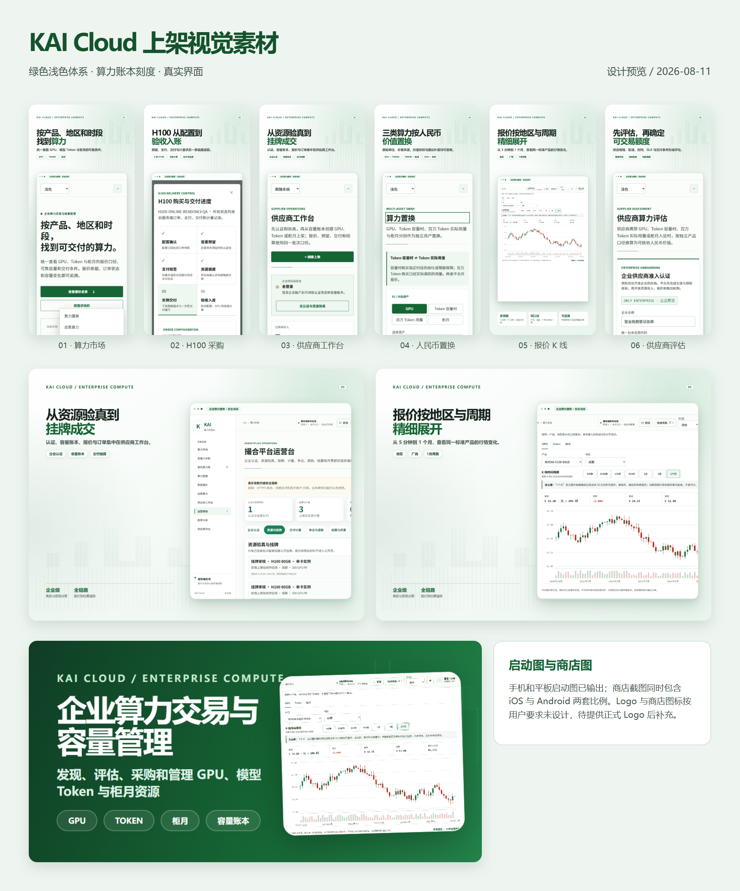

# KAI Cloud App 上架材料包

本目录根据现有 KAI Cloud 产品、绿色视觉系统和企业算力交易闭环整理。

## 两张图片专项交付

- `TWO_IMAGES_DELIVERY_INDEX.md`：图片一、图片二逐项交付映射；
- `TWO_IMAGES_MISSING_MATERIALS.md`：只包含两张图片范围内的最终空缺资料；
- `APP_BASIC_INFORMATION.md`：名称、包名、业务说明和版权格式；
- `STORE_LISTING_TEXT.md`：商店宣传文本、功能介绍、关键词和版本说明；
- `APP_REVIEW_MATERIALS.md`：三类审核账号方案、审核路径和示例订单说明；
- `SOFTWARE_COPYRIGHT_APPLICATION_DRAFT.md`：软件著作权申请文字底稿；
- `PRIVACY_LABEL_AND_DATA_SAFETY.md`：隐私标签与 Data safety 底稿；
- `CONTENT_RATING_AND_REVIEW_NOTES.md`：内容分级和审核备注底稿。

## 已设计

- App 中文名、英文名、副标题、业务说明；
- Apple App Store、Google Play 和国内安卓商店文案；
- Android 包名、iOS Bundle ID、版本与商店记录建议；
- 用户协议、隐私政策、注销说明草案；
- 审核账号结构、审核路径和审核备注；
- 隐私标签、Google Data safety 填报底稿；
- 内容分级建议；
- 软件著作权申请材料结构与版权声明；
- 手机商店截图、平板截图、Google Play feature graphic 和启动图。

## 用户明确排除或必须外部提供

- Logo 和基于 Logo 的商店图标；
- 客服邮箱、客服电话；
- 实际联系人和手机号；
- 运营主体法定名称、统一社会信用代码；
- 软件著作权登记证书；
- Apple、Google、华为等开发者账号和签名证书；
- 支付宝、微信支付生产凭证。

## 提交前必须替换

搜索本目录中的 `[`，逐项替换所有方括号占位。协议和隐私政策须由运营主体的法律顾问结合实际数据流、合同与地区要求复核。

## 视觉预览

## 文件

- `APP_STORE_RELEASE_PACKAGE.md`：商店元数据、审核、隐私标签、内容分级与软著材料；
- `USER_AGREEMENT_DRAFT.md`：用户协议草案；
- `PRIVACY_POLICY_DRAFT.md`：隐私政策草案；
- `ACCOUNT_DELETION_GUIDE.md`：账户注销说明；
- `assets/ASSET_INDEX.md`：视觉素材索引与使用说明。
